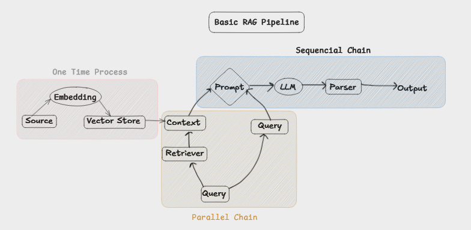

## **Problem Statement**

A system that can help to chat/interact with any Youtube videos.

We can ask questions related to videos and even summarize the video.

---

## **Final Product**

The final product can be like anything which we can make

1. Chrome Plugin:

   - The user can install extension and directly plug it to the browser and interact with the video.

2. Streamlit UI:

   - We can make a user interface where user can paste the video url and we can interact with that video.

---

## **Plan of Action**

1. Youtube video to Transcript.

   - This can be done using document loader
   - we can also use youtube own api to fetch transcript.(This is the one which we are going to use)

2. Split the transcript into chunks.
3. convert them to embeddings.
   - Before converting join the strings part and remove the timings part from them
4. store them to vector store.
5. Create retriever
   - This will use to embedd query and perform semantic search in vector store and return related query.
6. Merge original and retrieved result to create a prompt.
7. Pass this prompt to LLM to generate response.
8. Final Chain to connect all components.

---

## **Working Behind the Seens for Chain**

Whatever data source we needed we first load that _(In our case it was youtube transcript which we load using youtube api and remove time stamp from it and store the text only)_ `-->` Splitted the data into chunks `-->` Convert the chunks to embeddings `-->` Store those embeddings in vector store `-->` Point the retriver to vector store with search type and number of documents need to retrieve i.e `k`

when invoke with query `-->` query goes to retriever `-->` retriever fetch the similar `k` number of document list from vector store `-->` these documents are formatted to single paragraph and become context `-->` Now the context and query are combined together to form a prompt `-->` then this prompt goes to llm `-->` llm get the context and query and give answer `-->` the answer is parsed through string output parser for easy to view

---

## **Further Improvement(Advance RAG)**

1. UI Based Enhancement
2. Evaluation
   - RAGas
   - Langsmith
3. Indexing
   - Document Ingestion(Preprocessing, translation etc)
   - Text Splitting(Better Techniques)
   - Better vector store
4. Retreivel
   1. Pre-Retrievel
      - Query Rewriting using llm
      - Multi query generation
      - Domain aware routing
   2. During-Retrievel
      - MMR
      - Hybrid Retrievel
      - Reranking
   3. Post-Retrievel
      - Contextual Compression
5. Augmentation
   - Prompt Template
   - Answer Grounding(Always give answer from context only)
   - Context window optimization
6. Generation
   - Answer with citation
   - Guard railing (Restrictions)
7. System Design
   - Multimodel
   - Agentic
   - Memory Based
